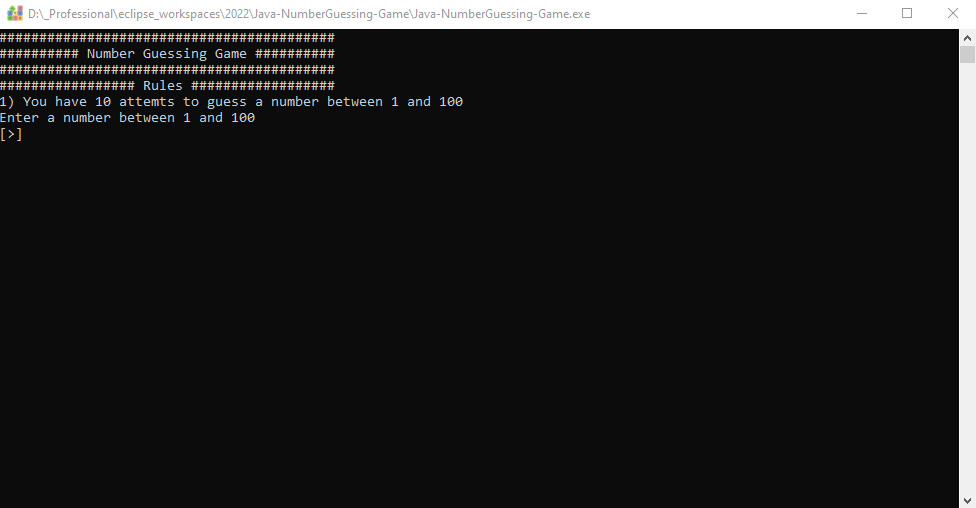

</a>

# Table of Contents

- [Table of Contents](#table-of-contents)
- [Screenshot of the Application](#screenshot-of-the-application)
- [Description](#description)
- [Instructions](#instructions)
- [Package(s) used within the Application](#packages-used-within-the-application)
- [System requirements](#system-requirements)
- [Source Code](#source-code)

---

# Screenshot of the Application

 

# Description

Simple desktop executable application, guessing game where the computer picks a number between 1 and 100 and the user has 10 guesses to guess correctly. The user is given feedback on whether their guess is too high or too low.

# Instructions

- Clone the repo and run the executable file `Java-NumberGuessing-Game.exe`

# Package(s) used within the Application

- java.util.Scanner;

# System requirements

- JavaSE-1.8 or higher.

# Source Code

The project was developed in Eclipse IDE and all source code and projects are uploaded as an Eclipse project for convenience.

- Source code is available to view in the src folder
- Compiled code located in the bin directory.
- Jar File
- Executable (.exe) File
